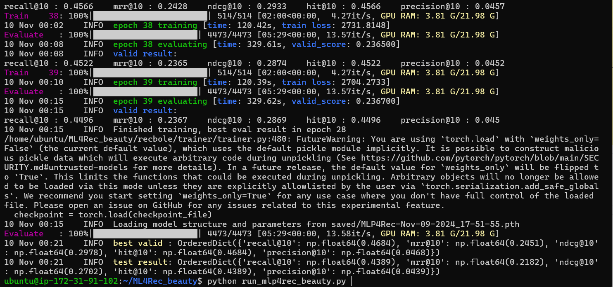
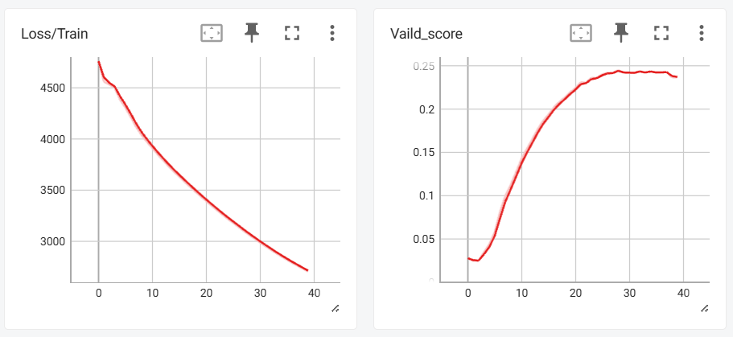
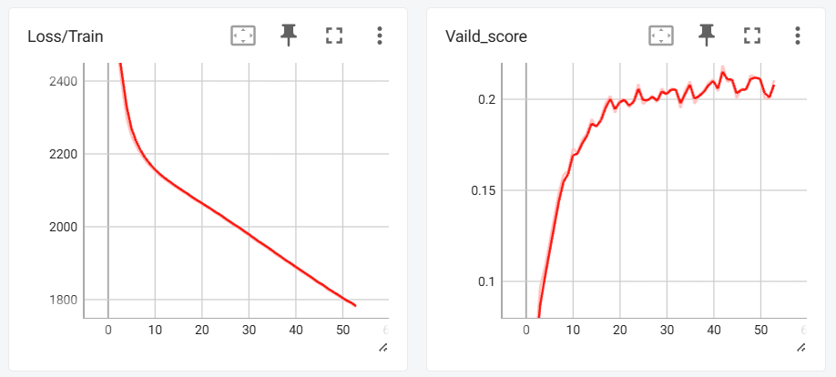

## Re-MLP4Rec: A Pure MLP Architecture for Sequential Recommendations (IJCAI 2022, Long Oral)

This is a reproduction code for the ML4Rec. Conducted as a part of Data Science Lab 3. 
Please refer to the logs for test results.
## Usage
- Clone the repository.
- Create virtual environment:
- `python -m venv myenv`
- `source myenv/bin/activate`
- Install packages: pip install -r requirements.txt
- Execute `python run_mlp4rec.py`

## Paper replication note:

Additionally, re-run_mlp4rec_beauty.py to train and evaluate on the beauty dataset. The beauty dataset can be downloaded from: https://recbole.s3-accelerate.amazonaws.com/ProcessedDatasets/Amazon_ratings/Amazon_Beauty.zip. 


## Screenshots
For Amazon Beauty


For MovieLens


Loss for Amazon Beauty


Loss for Movie Lens


## Citation for original papers

If you feel our work is insightful, please consider citing us 
```
@article{li2022mlp4rec,
  title={MLP4Rec: A Pure MLP Architecture for Sequential Recommendations},
  author={Li, Muyang and Zhao, Xiangyu and Lyu, Chuan and Zhao, Minghao and Wu, Runze and Guo, Ruocheng},
  journal={arXiv preprint arXiv:2204.11510},
  year={2022}
}
```
If your code involves any content from this repo, please also knidly cite RecBole
```
@inproceedings{recbole1.0,
  title={Recbole: Towards a unified, comprehensive and efficient framework for recommendation algorithms},
  author={Zhao, Wayne Xin and Mu, Shanlei and Hou, Yupeng and Lin, Zihan and Chen, Yushuo and Pan, Xingyu and Li, Kaiyuan and Lu, Yujie and Wang, Hui and Tian, Changxin and others},
  booktitle={Proceedings of the 30th ACM International Conference on Information \& Knowledge Management},
  year={2021}
}
```
```
@article{recbole2.0,
  title={RecBole 2.0: Towards a More Up-to-Date Recommendation Library},
  author={Zhao, Wayne Xin and Hou, Yupeng and Pan, Xingyu and Yang, Chen and Zhang, Zeyu and Lin, Zihan and Zhang, Jingsen and Bian, Shuqing and Tang, Jiakai and Sun, Wenqi and others},
  journal={arXiv preprint arXiv:2206.07351},
  year={2022}
}
```
